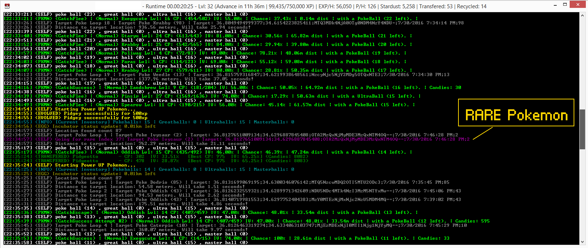

# Original fork [read description and FAQ there!] : https://github.com/NecronomiconCoding/NecroBot
# Lvl 32+ Pokemon GO Accounts Giveaway Events: http://www.monstermmorpg.com/Pokemon-GO-Giveaways 
# www.pokemonpets.com free Pokemon MMO RPG
[](http://www.pokemonpets.com/Register)
# www.monstermmorpg.com free Monster MMO RPG
[](http://www.monstermmorpg.com/Register)

## Features of Pokemon GO Rare Pokemon Hunting Farming Bot? 
- More advanced Pokemon hunting by PokemonGo Map
- Rare Pokemon priority hunting by PokemonGo Map
- More realistic hunting by staying in your local town without sniping
- Sniping is 100% ban without any false positives
- Auto switch between Pokemon hunting and PokeStop farming according to Poke Ball count
- Full scale account details logging. The details file is saved in the folder where you run your NecroBot.exe
- Perfectly stable can run over 24 hours
- I am farming 8 accounts right now. So, i am making changes as necessary as a farmer :D
- Never gets soft banned because it always do human walking with the speed limit you have defined
- Settings are optimized for Level 30+ farming
- More logical PowerUp/LevelUp Pokemon logic
- Pre-defined PokeStops location input. Thus, it can move to next PokeStop location once you are out of PokeBalls

## Why separate project?
- I have started as a separate project since i am still a total noob of GitHub code management system
- I have never collaborated previously with any other developers. Thus, I have to improve my skills first
- In future this project may discontinue if the all features here get added to Original Project

## How to use?
- First read the original Wiki here: https://github.com/NecronomiconCoding/NecroBot/wiki
- Download entire project
- Download sub module and copy paste into submodule folder
- Open the APP with Microsoft Visual Studio 2015
- Before starting the APP with F5, first go to Settings.cs which is located under PoGo.NecroBot.Logic
- Make all the settings you wish. Set your location, item counts, IV, evolve etc
- *
- Once you have the setup Click F5 run app first time then close it
- Then go to debug =>  config folder and enter your password username into auth.json file (do not worry i have checked files and these are secure)
- For deciding which rare Pokemon you want as priority, inside Settings.cs look for ```lstPriorityPokemon``` and change the PokemonId as you wish 
- *
- Now you need to install PokemonGo Map project in order to utilize our rare farming and priority farming
- PokemonGo Map github : https://github.com/AHAAAAAAA/PokemonGo-Map
- Follow the instructions there. Compose your config file
- In PokemonGo Map config file, you only have to put auth-service, username, password and location parameters rest is automatic
- Once you have installed and generated config file, double click runserver and it will start farming
- *
- Now you have to point your PokemonGo Map installation folder in our application
- In Settings.cs file change ```srPokemonGoMap_Directory``` variable to your installation folder 
-* 
- For using pre-defined PokeStop locations, prepare a text file type the cordinates each line like this 36.805327:34.6360770 and point that location to variable in the Settings.cs file **srSettingsDirectory**
- Name that text file as **predefined_pokestop_locs.txt**
- *
- Ready to rock :D

## Common errors and solutions
- Make sure you have installed visual studio 2015
- Open the app once and if you get error restart again and check nuget packages
- Set PoGo.NecroBot.CLI app as start up project
- Make sure you have correctly set the PokemonGo Map directory location
- Make sure you edit Settings.cs before start. Or edit the generated file inside debug => config folder
- Right click and check installed nuget tools for all the projects
- Delete all text files in your debug folder and restart the app
- Make sure that you have run the PokemonGO Map project and in that folder pogom file is composed which is the DB file

## What is the logic behind the Pokemon and Rare Pokemon farming
- It reads the live data from the PokemonGo Map database
- Then calculates the shortest distance having Pokemon to your current location and go for hunting it
- However, if you have setup priority list and if there is a priority Pokemon, instead of going to shortest distance Pokemon, first it goes to priority Pokemon
- Then from that location, it scans the database and goes after the shortest location pokemon to you. 
- Unless, if there is an another priority Pokemon :)
- If you get under total 25 Poke Balls, it starts priority farming the PokeStops until you get over 50 Poke Balls

## Multiple Instance Farming
- For multiple instance farming, copy entire debug folder and paste it into another folder
- For each folder, set your password and username inside debug => config => auth file
- Each time you made changes, do the same operation for changes to be updated

## What is lack?
- Nothing so far :D

## Screenshot from the best giveaway account farming :) 
### You can reach up to 80k exp per hour easily if servers are fine and based on your location
- No sniping necessary
- No teleport necessary
- KM per hour is 130 but still eggs are hatched perfectly
- Catch all you can while getting this much experience including Rares :D



<p>Feel free to ask any questions with opening issues</p>

<p>Thank you for reading</p>
